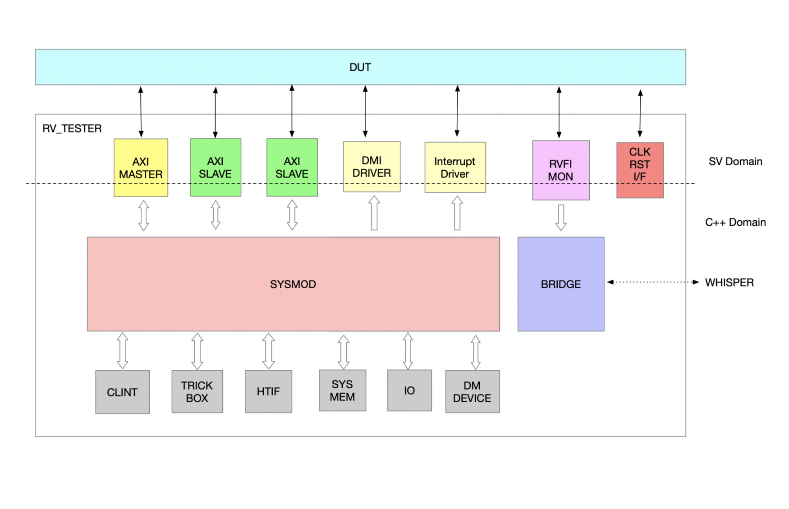

# rv_tester

Risc-v cpu testing component written in sv and c++

## Overview
This repository contains the verification collateral needed to interface with a RISCV CPU core and perform lockstep architectural checks against the [Whisper](https://github.com/tenstorrent/whisper) RISCV CPU ISS. ALong with this this repo contains soft device models, axi transactor and master. 

The main components involved here are
- RVFI Monitor
  - RVFI monitor samples signla from RISC-V Formal interface and passes it to bridge
- Whisper API 
  - Step on instruction retire
  - Receive CPU arch state changes relative to previous step
- Bridge
  - Orchestrate DUT vs ISS arch state collection
  - Send DUT vs ISS arch state to CAC
- CAC (Core Arch Checker)
  - Compare DUT vs ISS arch state
- AXI SW (transactor) 
  - Recieve requests from Riscv CPU AXI bus and create C++ transactions
- AXI MST SW
  - Convert C++ transactions into Systemverilog bus level activity
- Sysmod
  - system model devides memory range as specified in memmap and routes requests accordingly
- Devices (CLINT, TRICKBOX, HTIF,DM)
  - Model device specific functionality

